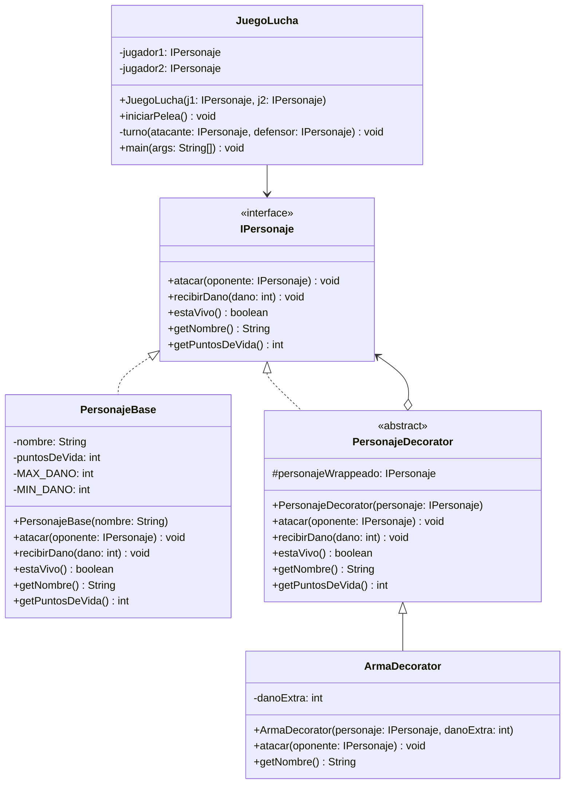

# Diagrama de Clases

```mermaid
classDiagram
    class IPersonaje {
        <<interface>>
        +atacar(oponente: IPersonaje) void
        +recibirDano(dano: int) void
        +estaVivo() boolean
        +getNombre() String
        +getPuntosDeVida() int
    }

    class PersonajeBase {
        -nombre: String
        -puntosDeVida: int
        -MAX_DANO: int
        -MIN_DANO: int
        +PersonajeBase(nombre: String)
        +atacar(oponente: IPersonaje) void
        +recibirDano(dano: int) void
        +estaVivo() boolean
        +getNombre() String
        +getPuntosDeVida() int
    }

    class PersonajeDecorator {
        <<abstract>>
        #personajeWrappeado: IPersonaje
        +PersonajeDecorator(personaje: IPersonaje)
        +atacar(oponente: IPersonaje) void
        +recibirDano(dano: int) void
        +estaVivo() boolean
        +getNombre() String
        +getPuntosDeVida() int
    }

    class ArmaDecorator {
        -danoExtra: int
        +ArmaDecorator(personaje: IPersonaje, danoExtra: int)
        +atacar(oponente: IPersonaje) void
        +getNombre() String
    }

    class JuegoLucha {
        -jugador1: IPersonaje
        -jugador2: IPersonaje
        +JuegoLucha(j1: IPersonaje, j2: IPersonaje)
        +iniciarPelea() void
        -turno(atacante: IPersonaje, defensor: IPersonaje) void
        +main(args: String[]) void
    }

    IPersonaje <|.. PersonajeBase
    IPersonaje <|.. PersonajeDecorator
    PersonajeDecorator <|-- ArmaDecorator
    PersonajeDecorator o--> IPersonaje
    JuegoLucha --> IPersonaje
```

Este diagrama representa el patron Decorator usado en el proyecto.
